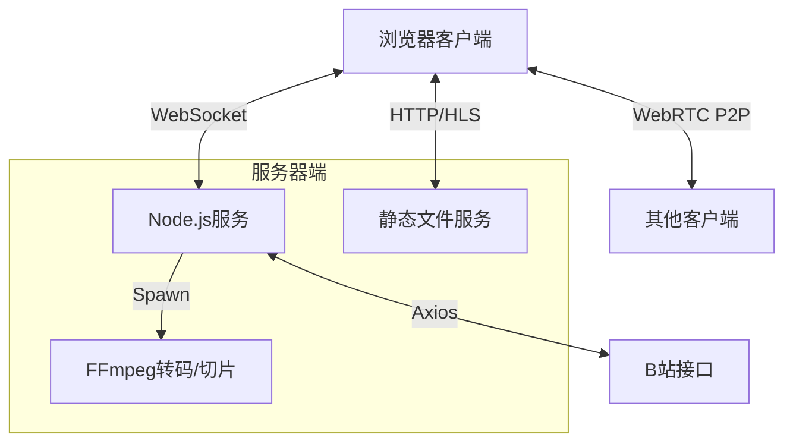

# 🎬 WatchTogether (在线放映室)

<div align="center">

> **距离不是阻碍，陪伴从未缺席。**
>
> 专为 **异地恋情侣**、**异地亲友** 打造的沉浸式在线同步放映室。
> 支持 B站无损直解、本地视频上传、实时弹幕互动、Socket.io 毫秒级同步。


[](LICENSE)
[](https://nodejs.org/)
[](https://socket.io/)
[](https://ffmpeg.org/)

</div>

---

## 📖 目录

- [🌟 亮点功能](#-亮点功能)
- [🏗️ 系统架构解析](#️-系统架构解析)
- [📦 快速部署](#-快速部署)
  - [环境要求](#环境要求)
  - [常规部署](#常规部署)
  - [宝塔面板部署](#宝塔面板部署)
- [🎮 使用指南](#-使用指南)
  - [B站详细使用说明](#b站详细使用说明)
  - [房间管理与权限](#房间管理与权限)
- [🛠️ 开发者指南](#️-开发者指南)
- [❓ 常见问题 (FAQ)](#-常见问题-faq)

---

## 🌟 亮点功能

### 1. 📺 Bilibili 影院级体验 (独家黑科技)
WatchTogether 不仅仅是简单的解析链接，它实现了一套完整的**流媒体代理系统**：
- **MSE 无损直解 (Media Source Extensions)**:
  - 许多 B 站解析器需要服务器先下载、合并视频，导致用户等待很久。
  - WatchTogether 采用**音视频分离下载**技术，服务器仅作为管道，将 B 站的视频流和音频流并行下载，直接推送到浏览器，由浏览器利用 GPU 进行实时合成。
  - **效果**: **秒开播放**，服务器 CPU 占用极低，带宽利用率最大化。
- **大会员画质解锁**:
  - 支持手机 B 站 App 扫码登录，Cookie 仅保存在你的服务器内存中。
  - 成功登录后，可直接解析并播放 **1080P 高码率 / 4K / 杜比视界** 等会员专享画质。
- **沉浸式还原**:
  - 自动加载视频弹幕、分P列表、视频简介。
  - 甚至连 B 站的弹幕颜色、位置都能完美还原（开发中）。

### 2. ⚡ Socket.io 毫秒级同步引擎
- **全状态同步**: 播放/暂停、进度跳转、倍速调整 (0.5x - 2.0x)、音轨切换。
- **智能追赶机制**:
  - 当某个用户网络卡顿（如缓冲慢），系统会检测到其进度落后。
  - 若落后超过 2 秒，系统会自动将其“传送”到当前大部队的进度，确保没人会被遗忘。
  - 右上角实时显示所有成员的同步状态（🟢 已同步 / 🟡 缓冲中）。

### 3. 🖥️ WebRTC P2P 屏幕共享
- **零延迟直连**: 画面的每一帧都直接从房主电脑传输到观众电脑，不经过服务器中转，为您节省昂贵的服务器带宽。
- **高清画质自定义**: 
  - 房主可自由调节码率（1Mbps - 8Mbps）和帧率（24fps - 60fps）。
  - 支持系统音频内录共享（需使用 Chrome 浏览器）。
- **国内优化**: 内置了国内可用的 STUN 服务器列表（小米、腾讯等），大幅提高 P2P 穿透成功率。

### 4. 🚀 P2P 视频流加速 (节省带宽)
- **分布式多点传输**: 
  - 采用 **WebRTC DataChannel** 技术，将同一个房间内的观众组成一个 P2P 网络。
  - 当你在观看视频时，浏览器会自动从其他观众那里获取已经缓存的视频片段。
- **智能调度系统**:
  - `p2p-loader.js` 核心模块实时监控 P2P 节点的健康状况和网络速度。
  - 自动在 HTTP 源站下载和 P2P 邻居下载之间动态切换，确保播放流畅不卡顿。
  - **效果**: 显著降低服务器带宽压力（最高可节省 90% 流量），多人观看更流畅。

### 5. 📂 强大的本地媒体支持
- **全格式兼容**: MP4, MKV, FLV, AVI, MOV, WMV 等。
- **HLS 并行切片**: 
  - 上传大文件（如 2GB 的电影）时，服务器会自动启动多进程并行转码。
  - 利用多核 CPU 将视频切割为 HLS切片 (.ts)，实现“边转边播”，无需等待整个文件转换完成。
- **字幕挂载**: 支持 .srt, .ass, .vtt 字幕文件即时上传、挂载和样式渲染。
### 6. 🌐 网页视频解析 (全网通杀)
- **yt-dlp 内核**: 集成强大的 yt-dlp 解析引擎，支持 **1000+** 主流视频网站。
- **插件式规则引擎**: 
  - 支持用户自定义 JSON 规则扩展解析能力。
  - 详见 [规则编写指南](parsers/rules/RULES_GUIDE.md)。

### 7. 📱 移动端完美适配
- **Tab 分页设计**: 手机端采用折叠式 Tab 界面，通过切换“链接/上传”、“B站”、“解析”三个标签页，大幅节省屏幕空间。
- **iOS 原生全屏**: 针对 iOS Safari/Webkit 内核限制，自动降级调用系统原生播放器全屏，确保在 iPhone/iPad 上也能获得流畅体验。
- **触控优化**: 专门针对手机屏幕优化的控制栏，隐藏不必要的按钮，调整触控区域大小，防止误触。

---

## 🏗️ 系统架构解析

本项目采用前后端分离的架构设计，但在部署上进行了合并，方便个人用户一键启动。



| 模块 | 技术栈 | 说明 |
| :--- | :--- | :--- |
| **前端** | HTML5, CSS3 (Glassmorphism), Vanilla JS | 纯原生开发，无 React/Vue 重型框架，极速加载 |
| **后端** | Node.js, Express | 轻量级 Web 服务，处理 API 和静态资源 |
| **通信** | Socket.io v4 | 负责房间管理、状态同步、信令交换 |
| **媒体处理** | FFmpeg, Fluent-FFmpeg | 负责视频转码、获取元数据、生成缩略图 |
| **流媒体** | video.js, hls.js, Dash.js | 前端播放器核心，支持 MSE 和 HLS |
| **视频解析** | yt-dlp, 自研规则引擎 | 支持 1000+ 网站解析，可扩展的 JSON 规则系统 |

---

## 📦 快速部署

### 环境要求

1.  **操作系统**: Linux (CentOS 7+, Ubuntu 18.04+, Debian 10+) 或 macOS
2.  **Node.js**: **v16.0.0** 或更高版本 (推荐 v18 LTS)
3.  **FFmpeg**: 必须安装，用于处理视频和字幕。
4.  **yt-dlp** (可选): 用于解析第三方视频网站，不安装则无法使用网页解析功能。
5.  **带宽**: 建议上行带宽 **5Mbps** 以上 (如果是异地观看 1080P 视频)。

### 常规部署

#### 1. 安装 FFmpeg
```bash
# Ubuntu/Debian
sudo apt update && sudo apt install ffmpeg

# CentOS 7
sudo yum install epel-release -y
sudo yum install ffmpeg -y
# 如果 yum 找不到 ffmpeg，请使用 snap 安装:
# sudo yum install snapd && sudo systemctl enable --now snapd.socket && sudo ln -s /var/lib/snapd/snap /snap && sudo snap install ffmpeg
```
验证安装：`ffmpeg -version`

#### 1.5 安装 yt-dlp (可选，用于网页视频解析)
```bash
# macOS (推荐)
brew install yt-dlp

# Linux (通用)
sudo curl -L https://github.com/yt-dlp/yt-dlp/releases/latest/download/yt-dlp -o /usr/local/bin/yt-dlp
sudo chmod a+rx /usr/local/bin/yt-dlp

# 或使用 pip
pip install yt-dlp
```
验证安装：`yt-dlp --version`

#### 2. 下载源码
```bash
git clone https://github.com/Entropy-Xu/OnlineMediaPlayer.git
cd OnlineMediaPlayer
```

#### 3. 安装依赖 & 启动
```bash
# 安装依赖
npm install

# 启动服务 (前台运行，测试用)
npm start

# 后台运行 (生产环境推荐)
npm install -g pm2
pm2 start server.js --name "watch-together"
pm2 save
pm2 startup
```
现在，访问 `http://服务器IP:3000` 即可。

### 宝塔面板部署

对于新手用户，可以在宝塔面板中通过【Node项目】功能一键部署。
👉 **[点击查看详细图文教程 DEPLOY_BAOTA.md](DEPLOY_BAOTA.md)**

---

## 🎮 使用指南

### B站详细使用说明
1.  **输入链接**: 将 B站视频链接（如 `https://www.bilibili.com/video/BV1xx411c7mD`）粘贴到顶部输入框。
2.  **点击解析**: 系统会自动获取视频信息。
3.  **选择分P**: 如果视频有多P，可在弹窗及下拉菜单中选择。
4.  **登录账号 (推荐)**: 
    - 点击右上角或弹窗内的【登录 B站】按钮。
    - 使用手机 B站 App 扫描屏幕上的二维码。
    - 登录成功后，清晰度下拉菜单中会出现 `1080P+`, `4K` 等选项。
5.  **开始播放**: 点击播放，服务器会自动开始下载流数据并传输给所有房间成员。

### 房间管理与权限
- **房主 (Host)**: 
  - 创建房间的用户自动成为房主（有👑皇冠标识）。
  - 只有房主可以进行：拖动进度条、切换视频、管理用户。
- **权限下放**:
  - 房主点击右上角的【设置】⚙️ 按钮，可以开启“允许所有人控制”。
  - 开启后，任何成员都可以暂停、跳转进度。
- **房间密码**:
  - 只有在通过 URL 参数进入时，或后续开发版本中才支持设置密码 (当前版本为公开房间)。

---

## 🛠️ 开发者指南

如果您想对项目进行二次开发：

### 项目结构
```
OnlineMediaPlayer/
├── public/              # 前端静态资源
│   ├── css/             # 样式文件 (Glassmorphism UI)
│   ├── js/              # 前端逻辑
│   │   ├── room.js      # 核心逻辑：Socket通信、播放器控制
│   │   └── ...
│   └── lib/             # 第三方库 (font-awesome 等)
├── parsers/             # 视频解析器模块
│   ├── index.js         # 解析器统一入口
│   ├── ytdlp.js         # yt-dlp 封装 (支持 1000+ 网站)
│   ├── generic.js       # 影视聚合站通用解析器
│   ├── ruleEngine.js    # JSON 规则引擎
│   └── rules/           # 解析规则目录
│       ├── schema.json  # 规则 JSON Schema
│       ├── *.json       # 内置规则文件
│       └── user/        # 用户自定义规则
├── uploads/             # 上传文件存储目录 (自动生成)
├── server.js            # 后端入口 & Socket.io 逻辑
├── bilibili.js          # B站 API 封装模块
├── DEPLOY_BAOTA.md      # 部署文档
└── package.json         # 项目依赖
```

### 关键 API 端点
- `GET /api/room/:roomId`: 获取房间信息
- `GET /api/bilibili/video/:bvid`: 获取 B站视频信息
- `POST /api/upload`: 上传本地视频/字幕
- `GET /api/parser/status`: 获取解析器状态 (yt-dlp 是否可用)
- `POST /api/parser/info`: 获取视频信息 (不下载)
- `POST /api/parser/parse`: 解析并获取播放地址
- `GET /api/parser/rules`: 获取已加载的解析规则列表
- `POST /api/parser/rules`: 添加用户自定义规则
- `POST /api/parser/rules/test`: 测试解析规则

---

## ❓ 常见问题 (FAQ)

**Q: 上传的视频一直显示“转码中”且不动？**
A: 请检查服务器是否安装了 `ffmpeg`。如果是在宝塔面板，通过终端输入 `ffmpeg -version` 确认是否报错。另外，检查 `uploads` 目录是否有写入权限。

**Q: 为什么 B站视频卡顿？**
A: 
1. **服务器网络**: 您的服务器连接 B站 CDN 的速度决定了下载速度。如果是海外服务器，建议使用国内中转或更换为香港 CN2 线路。
2. **客户端带宽**: 播放 1080P 视频需要观众端有至少 3Mbps 的下行带宽。

**Q: 屏幕共享无法建立连接？**
A: 屏幕共享基于 P2P。由于国内网络环境复杂（NAT 类型限制），部分移动宽带或校园网可能无法直连。
**解决方案**: 您可以自行搭建 TURN 服务器，并在 `public/js/room.js` 中的 `rtcConfig` 中添加您的 TURN 服务器配置。

**Q: 修改了代码没生效？**
A: 前端代码 (`public/` 目录下) 修改后刷新浏览器即可生效。后端代码 (`server.js`) 修改后需要重启 Node 服务 (`pm2 restart watch-together`)。

---

## 📄 许可证

本项目采用 [GPL-3.0 许可证](LICENSE)。
您可以自由地修改、分发本项目，但您的修改版本也必须开源。
